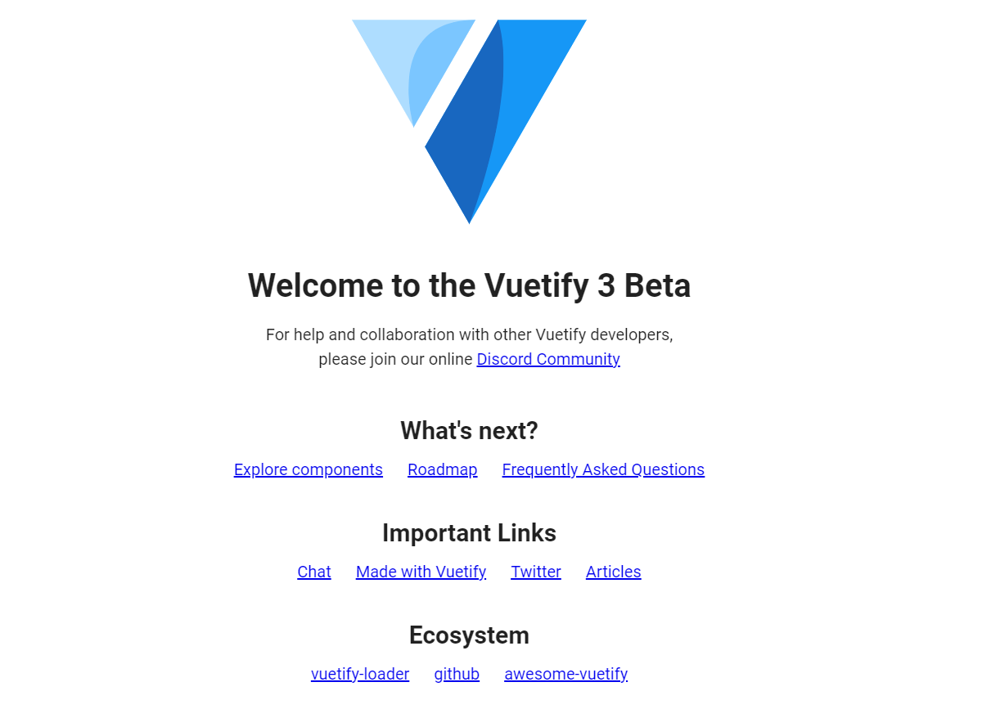

# Lab 5A - Vue.js Front-End App

## Overview

You've now created an API and hosted it so that it's publicly available. But an API is not great for average users who want to interact with your application. So we'll make a client that will communicate with your API.

We'll be using Vue.js, a front-end javascript framework built on Node.js, which makes development very nice and easy, but also provides some incredibly useful tools that make building a website incredibly nice. It is strongly recommended to review each of the resources before starting this lab.

Your front-end development is divided between Lab 5A and 5B. In this, Part 1, you will set up the View framework and implement the AppBar which has the Login and Logout functions.

In Lab 5B (Part 2) you will complete the other two components: TaskList, and NewTaskForm, and deploy your functioning app to your live server.


### Functionality

- Front-end only framework that communicates with a backend

### Concepts

- Vue.js
  - Build Tools (webpack)
  - Single-Page Apps
  - Components
    - Props
    - Data
    - Methods
    - Computed
- CI/CD Pipelines
- XHR Requests (AJAX)
  - `fetch()` Browser API
- Progressive Web Apps (PWA)

### Resources

- [What is Vue.js?](https://vuejs.org/v2/guide/#What-is-Vue-js)
- [Vue CLI](https://vuejs.org/v2/guide/installation.html#CLI)
- [Vue.js devtools](https://chrome.google.com/webstore/detail/vuejs-devtools/nhdogjmejiglipccpnnnanhbledajbpd?hl=en)
- [Intro to Vue 3](https://learnvue.co/articles/intro-to-vue-3)

## Instructions

### Step 1: Setup
1. Clone the lab-5A git-hub repo from Learning Suite onto your computer.

2. Install the VUE framework using this command: 

   ```sh
   npm install -g @vue/cli --force 
   ```
   After installing, run the following command in a terminal:

   ```sh
   vue ui
   ```
   
   If your vue ui does not work execute the following command:
   ```
    Set-ExecutionPolicy -Scope Process -ExecutionPolicy Bypass
   ```

3. Open a browser to [http://localhost:8000/project/select](http://localhost:8000/project/select) and click `Create`

   - Make sure the path is the repository cloned from Learning Suite and click `Create a new project here`.

4. On the `Details` tab:
    - Select `npm` as the "Package manager"
    - Deselect `Initialize git repository` (you should already have a repository from cloning your project, so you don't need to initialize a new one)
    - Click `Next`
   

5. You should now be in the `Presets` tab

   - Select `Manual` and click `Next`

6. Make sure **only** the following features are selected, then click `Next`:

   - Babel
   - Progressive Web App (PWA) Support
   - Router
> Note: Linter/Formatter is selected by default. Make sure to uncheck it.
7. In the `Configuration` tab:
   - Set the Vue.js version to `3.x`
   - Enable history mode for router

8. Click `Create Project`

9. You should now be looking at [http://localhost:8000/dashboard](http://localhost:8000/dashboard)

   - Click the `Configuration` tab on the left
   - Click the PWA tab
   - Give your app a name
   - Change the colors if you want to

### Step 2: Create your Project

1. Open the project in VSCode.

2. Install the [Volar](https://marketplace.visualstudio.com/items?itemName=Vue.volar) extension for VSCode

3. Explore your app

   - You'll notice that almost all of the `.vue` files have 3 sections:
     - `<template>`
       - This is where your HTML for the component goes
       - Just regular HTML with some interesting attributes that tell Vue what to do
     - `<script>`
       - The code behind your component
       - This is where you define how your component uses the data available to it
     - `<style>`
       - This is just plain CSS, and if you add the `scoped` attribute to the `<style>` tag, the CSS will only apply to the HTML in the `<template>` section, and nowhere else on the site
   - You can leave the `HelloWorld` component as-is, and use it as a reference for the future
   
4. Add a Vue Plugin called `Vuetify`

   - Go to the [dashboard](http://localhost:8000/dashboard) and click Plugins
   - Click <kbd>+ Add plugin</kbd> on the top right
   - Search "vuetify"
   - Select `vue-cli-plugin-vuetify`
   - Click <kbd>Install vue-cli-plugin-vuetify</kbd> on the bottom-right
   - Once it installs, it will ask you to configure the plugin
     - Select the `Vuetify 3 - Vue CLI (preview)` option from the dropdown
   - Click <kbd>Finish installation</kbd>

5. Go to the integrated terminal in VSCode and run the command `npm run serve` to run your app

   >When you make changes in your code, you'll notice that it automatically re-loads in the browser. That's one of the many benefits of working with front-end frameworks. They take care of a lot for you so that you can focus on development.

   
   

### Step 3: Connect your API
If you set up your API correctly in the last lab all you should need to do to hook up the Vue application is change the `.env` variable `CLIENT_ORIGIN` to whatever the current URL of your front-end Vue project is when it's running. Make sure not to have a dangling `/` on the end of your `CLIENT_ORIGIN` URL.

   >Tip: To run your server without having a console open constantly, you can use the __global__ npm package [pm2](https://pm2.keymetrics.io/). Use the command `npm i -g pm2`. The `-g` flag tells npm to install the package globally, as a command-line tool (not to your `package.json`). Run your server using `pm2 start server.js`. If you need to stop it, run `pm2 stop server.js` or `pm2 stop all`. 


### Step 4: Modify Your Vue Project

So now you have a working Vue app! The next step is to modify the project to make it do what you want it to do.

>Before you continue: Read the provided [Vue Basics Document](Vue-Basics.md) as you'll want to understand what's happening. Also, make sure that before you ask the TAs any questions that you read ALL of the comments in the provided code. They may answer your question.

>Note: If any of the following files or folders do not exist, create them.

1. `.env`
   - Make sure the `.env` file is on the same level as `package.json` called `.env` (you may copy the file `.env.example`)
   - Add a variable called `VUE_APP_API_ORIGIN` that's set to the URL of your running API
     - This is so that it's easy to switch between your development API and your Vue frontend
   - Make sure you add `.env` to the `.gitignore` file so that it does not get uploaded to github (It is NOT there by default). Make sure before you commit that your env file is not staged.

2. `public/_redirects`

   - There should be no file extension, JUST the name (i.e. NOT `_redirects.txt`)
   - Add the following line and save the file:
     ```
     /*    /index.html   200
     ```
>Tip: The next part of the lab is complicated and involves editing a lot of files. The best way to go about completing the application would be to download/copy all the files first and read all the `TODO` comments in each file to understand the relationship between them. After you understand the basics of the code that is already written for you and which files depend on others, start adding your code in a way that makes sense to you. You do not have to complete the files in the order they are listed below.

#### Views

1. `src/views/Login.vue`

   - We provide this file for you, [download or copy it from here](Login.vue) and put it in the `src/views` folder

2. `src/views/Home.vue`

   - We provide this file for you, [download or copy it from here](Home.vue) and put it in the `src/views` folder
   - Finish the component by taking care of all of the `TODO` comments

### App Setup

1. `src/App.vue`
   - We provide this file for you, [download or copy it from here](App.vue) and put it in the `src` folder. This file will define the parts of your application that need to be on every page. For instance, in this file, you will create a navbar that will appear on top of all the other pages in your application. 
   - Use the [Vue documentation](https://vuejs.org/guide/components/props.html) to figure out how to use props
     >Note: Passing props to a "view" is different than to a "component". We first have to pass the props into the `<router-view>` component, and then in the `router/index.js` file, we have to tell Vue Router which route will use these props by setting `props: true` on the route.
   - Finish the component by taking care of all of the `TODO` comments
   
2. `src/util/index.js`

   - We provide this file for you, [download or copy it from here](index.js) and put it in the `src/util/index.js`

3. `src/router/index.js`

   - Import the `authenticated` method from `'@/util'`
   - Add this `checkAuth` method above where `const routes` is defined:
     ```js
     const checkAuth = async (to, from, next) => {
       try {
         if (await authenticated()) next()
         else next({
           path: '/login',
           replace: true
         })
       } catch (error) {
         console.error(error.message)
         next({
           path: '/login',
           replace: true
         })
       }
     }
     ```
   - Modify the route object for the `Home` route:
     ```js
     {
       path: '/',
       name: 'Home',
       component: Home,
       beforeEnter: checkAuth,
       props: true
     }
     ```
   - Add a `Login` route:
     ```js
     {
       path: '/login',
       name: 'Login',
       component: Login,
     }
     ```
   - Remember to import the appropriate components for each route from the `'@/views'` folder

#### Components

1. `src/components/AppBar.vue`

   - We provide this file for you, [download or copy it from here](AppBar.vue) and put it in the `src/components` folder
   - Finish the component by taking care of all of the `TODO` comments

Build your project and make sure you can login and logout. You do not have to deploy to your AWS server for Part 1 though doing so will help you prepare for Part 2.

Be sure to commit your changes and push them to GitHub.

## Coming up in Part 2

You will complete the remaining components, TaskList and NewTaskForm, test the app, and deploy it to your live server.

# Vue.js Part 1 Passoff

- [ ] 5 Points - First commit is on or before Friday
- [ ] 5 Points - Source code is pushed to GitHub
- [ ] 8 Points - Secrets are protected
  - No secrets are found on GitHub
- [ ] 10 Points - Your VUE app connects to your Lab 4B server via REST calls
- [ ] 12 Points - A user who registered on your server site can log in on your Vue site
- [ ] 12 Points - Logging out makes it so the home page redirects to `/login` again
- [ ] 5 Points - GET request to `/api/v1/user` can also be hit manually after logging in
- [ ] 8 Points - If you are logged out, trying to navigate to the home page automatically redirects to the login page

> For extra credit to apply all passoff requirements need to be met

# Extra Credit
 
> Note: TAs cannot help you with extra credit!

- [ ] 10 Points - Show user's Google photo and name instead of their email on the side drawer
  - HINT: You'll have to change the backend to include another scope when authenticating with Google, then pass that data to the front-end somehow

# Sources:
- props explained:
- Vue 3 documentation
- methods documentation/explained:

